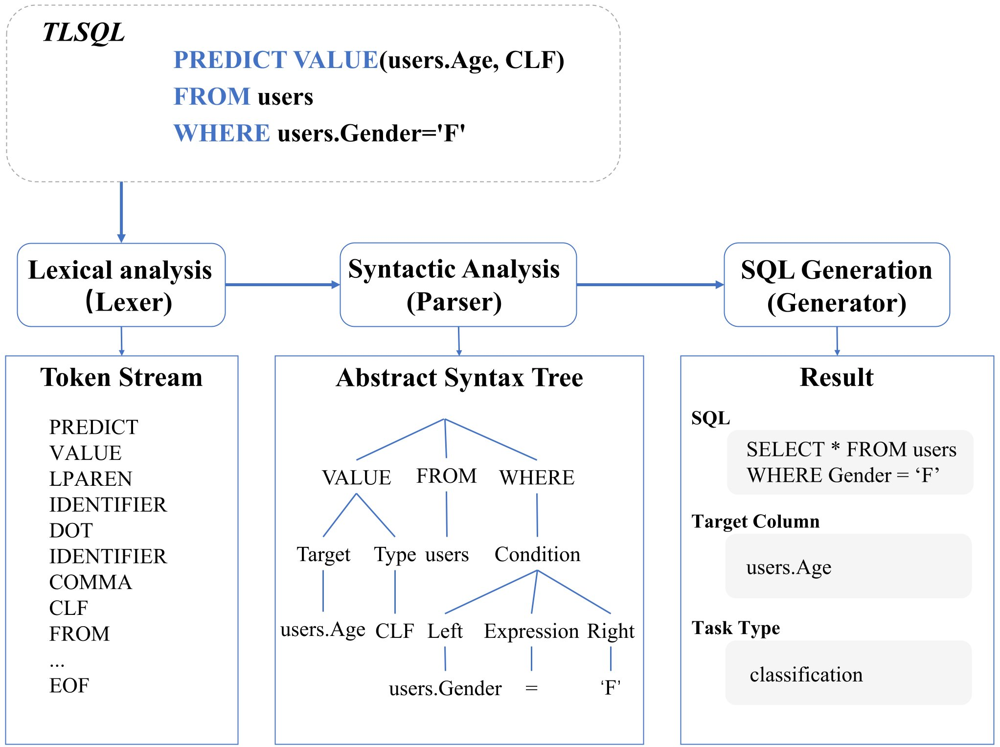

TLSQL Documentation
===================

TLSQL is a system designed to simplify machine learning workflows on structured tabular data. It translates SQL-like statements into standard SQL queries and structured learning task descriptions, enabling data scientists and engineers to focus on model development instead of writing complex SQL or manually managing datasets.

TLSQL works seamlessly with **RDBs, data warehouses, and data lakes**, enabling end-to-end table-based ML workflows.

Overview
--------

TLSQL supports three types of statements that map directly to ML workflows:

- **PREDICT VALUE**: Test set, target column and task type (REQUIRED).
- **TRAIN WITH**: Training set.
- **VALIDATE WITH**: Validation set.

.. centered:: **The TLSQL Workflow**

Quick Start
-----------

.. code-block:: python

    import tlsql
    
    result = tlsql.convert(
        predict_query="PREDICT VALUE(users.Age, CLF) FROM users WHERE users.Gender='F'"
    )
    print(result.predict.statement_type)  # 'PREDICT'
    print(result.predict.target_column)   # 'users.Age'
    print(result.predict.task_type)       # 'CLF'
    
Components
----------

**API:**

- :py:func:`tlsql.convert` - Main conversion function.

**Core Components:**

- :doc:`modules/core/lexer` - Tokenizes TLSQL text into tokens.
- :doc:`modules/core/parser` - Parses tokens into Abstract Syntax Tree (AST).
- :doc:`modules/core/sql_generator` - Generates standard SQL from AST.
- :doc:`modules/core/ast_nodes` - AST node definitions.
- :doc:`modules/core/tokens` - Token type definitions.
- :doc:`modules/core/exceptions` - Exception classes for error handling.

Contents
--------

.. toctree::
   :maxdepth: 2

   modules/core

Indices and Tables
------------------

* :ref:`genindex`
* :ref:`search`
